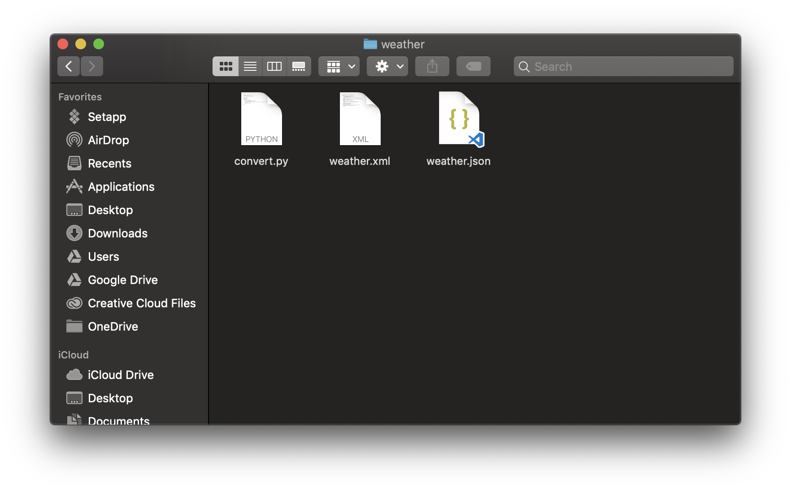

# Theinternship.io

## 🧠 Word Guessing Game
[ 👉 Full Description](https://github.com/RawitSHIE/Internship.io/tree/master/hangman)

เกมทายคำตามหมวดหมู่ที่ทางผู้เล่นเลือกโดยจะมี `hint` ให้กับผู้เล่น
โดยกฎกติกาเป็นดังนี้

1. การทายคำแต่ละคำนั้นจะมีคะแนนตาม จำนวนตัวอักษร * 15
2. การทายถูกแต่ละครั้งจะได้ 15*n คะแนน (n จำนวนอักษรที่เราทายอยู่ในคำนั้นๆ)
3. การทายผิดจะถูก -5 คะแนน
4. สามารถทายผิดได้ 10 ครั้ง
5. คำที่ผู้เล่นทายมาจะไม่สามารถทายซ้ำได้ (จะไม่คำนวนคะแนนส่วนนั้น)

โดยเกมจะมีหมวดหมู่คำอยู่ 3 หมวดคือ
1. Computer Knowledge ซึ่งจะเป็นความรู้พื้นฐานทางคอมพิวเตอร์ต่างๆ
2. Big Company ซึ่งจะเกี่ยวกับชื่อบริษัทดังๆในโลก
3. Famous Person ซึ่งจะเกี่ยวกับชื่อของคนดังในโลกตอนนี้

ส่วนของการเลือก Category
```
Select Category:
1. Computer Knowledge
2. Big Company
3. Famous Person
```
ส่วนขอการทายคำ
```
Hint: "Real life iron man"
_ _ _ _   _ _ _ _        score 0/120, remaining guess word 10
e
E _ _ _   _ _ _ _        score 15/120, remaining guess word 10
i
```

## 🛠 XML to JSON

[ 👉 Full Description](https://github.com/RawitSHIE/Internship.io/tree/master/weather)

การแปลง weather.xml เป็น weather.json ในที่นี้จะใช้ Python Module ที่ชื่อว่า `xmlttodict` ซึ่งต้องทำการลงตัว Module เพิ่มก่อน

> วิธีการลง [xmltodict](https://github.com/RawitSHIE/Internship.io/tree/master/weather#pre-required)

การที่จะ execute file `weather.py` ทำได้ด้วยการ พิมคำสั่ง execute ของ python ด้วย relative path ไปยัง file `weather.xml`

```
python3 weather.py [path to weather.xml]
```
> ถ้าที่นี้ path ของ weather.xml อยู่ path เดียวกับ weather.py

เมื่อทำการ run คำสั่งดังกล่าวแล้วก็จะมี file ที่ชื่อว่า weather.json สร้างขึ้นมาใน folder ที่ weather.py อยู่
```
weather.json is written
```



>source [XMLTODICT](https://github.com/martinblech/xmltodict)


# Contact
<center>

|<a href=""></a>  |
| :-: |
|รวิชญ์ โลหะขจรพันธ์|
|      Rawitgun@gmail.com      |
|     0910349301    |

</center>