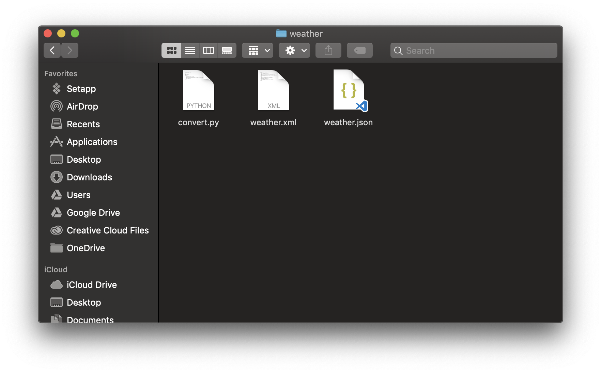

# 🛠 XML to JSON

การแปลง weather.xml เป็น weather.json ในที่นี้จะใช้ Python Module ที่ชื่อว่า `xmlttodict`  
## Pre-required
* python 3
* [XMLTODICT](https://github.com/martinblech/xmltodict)
* file `weather.py`
* file `weather.xml`

การที่จะ execute file นั้นจะต้องทำการ install module ที่ชื่อว่า `libtoxml`
โดยการที่จะลง `libtoxml` นั้นมีอยู่หลายวิธี วิธีที่แนะนำก็คือ ใช้ `pypi`
โดยใช้คำส่ง

```
pip install xmltodict
```

แต่สำหรับบางเครื่องที่มี `python` มากกว่า 1 version ซึ่ง version ที่ตัว code เขียนขึ้นนั้นจะเป็น `python3` ดังนั้นในบางครั้งที่เรา install ไป แล้ว execute ไม่ผ่านให้ลองเป็นคำสั่งด้านล่าง
```
pip3 install xmltodict
```
หรือถ้าต้องการตรวจสอบว่ามีการ install อะไรไปแล้วบ้างให้พิมคำสั่ง
```
pip list
```
หรือ
```
pip3 list
```
ตาม version

> สามารถดูวิธีลงแบบอื่นๆได้ ที่ [How to install xmltodict](https://github.com/martinblech/xmltodict#ok-how-do-i-get-it)

# How to excute
การที่จะ execute file `weather.py` ทำได้ด้วยการ พิมคำสั่ง execute ของ python ด้วย relative path ไปยัง file `weather.xml`

```
python3 weather.py [path to weather.xml]
```
> ถ้าที่นี้ path ของ weather.xml อยู่ path เดียวกับ weather.py

เมื่อทำการ run คำสั่งดังกล่าวแล้วก็จะมี file ที่ชื่อว่า weather.json สร้างขึ้นมาใน folder ที่ weather.py อยู่




# Contact
<center>

|<a href=""></a>  |
| :-: |
|รวิชญ์ โลหะขจรพันธ์|
|      Rawitgun@gmail.com      |
|     0910349301    |

</center>

Python Module<br>
>source [XMLTODICT](https://github.com/martinblech/xmltodict)